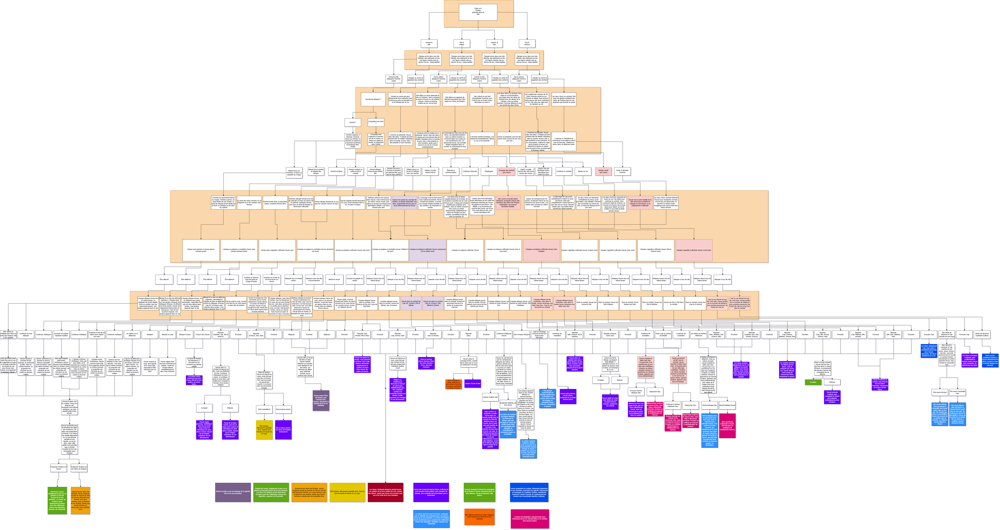

# Brief de Projet - À fournir à l'équipe testeuse

**Nom de votre équipe :** [Équipe JDMania]  
**Nom du projet :** [Les héros de l'éclipse]  
**Type de projet :** [Trace ton chemin]  
**Date :** 3 décembre 2024

---

## 🔗 Accès au projet

**URL du site déployé :**

- Si GitHub: [https://github.com/mathieuwillett/webapp-creative-justin-ahmed-mathieu]


## 🔗 Accès à votre Trello pour l'ajout de fiches de bogues

https://trello.com/b/JcKOFoZN/trelloprojetfinalweb

---

## 📖 Description du projet

### Concept général

["Les Héros de l'Éclipse est une histoire interactive où le joueur incarne plusieurs super-héros qui doivent défendre leur ville d'un dieu intergalactique. Les choix du joueur influencent l'histoire et mènent à 11 fins différentes."]

---

## ✅ Fonctionnalités implémentées (DONC À TESTER)

### PRIORITÉ HAUTE (fonctionnalités principales)

#### Pour "Trace ton chemin"

Remplacer le [X] par le nombre réel de votre projet

- [x] Lecture de [X] chapitres
- [x] Système de choix fonctionnel
- [x] [X] branches narratives
- [x] [X] fins différentes accessibles
- [x] Tracking de [karma/stats/inventaire/flags]
- [x] Historique des décisions (dans un menu ou à la fin)
- [ ] Autres spécificités de votre projet à mentionner aux testeurs?

### PRIORITÉ MOYENNE

- [x] Responsive (mobile, tablette, desktop)

### PRIORITÉ BASSE (bonus si temps)

- [x] [Fonctionnalité bonus] (audio si on l'a réparé)

---

## ❌ Fonctionnalités NON implémentées

**Important : Ne PAS reporter ces éléments comme bugs**

S'il y a des choses qui n'ont pas été faites dans votre projet et qui ne sont donc à ne pas tester, veuillez les lister ici pour laisser savoir à vos testeurs plutôt que de les faires chercher pour rien.


- ❌ [Exemple : Sauvegarde LocalStorage (optionnelle - pas faite)]
- ❌ [Exemple : Animations GSAP (optionnelles - pas faites)]
- ❌ [Exemple : Mode sombre]

---

## 🧪 Cas de test suggérés

Suggérez au testeurs de tester des cas précis dans votre appli. Listez-les cas ici.

### Test 1 : [Choix]

**Objectif :** Vérifier que les choix fonctionne

**Étapes :**

1. [Essayer tous les choix]

**Résultat attendu :**

[Se rendre à la fin]

---

### Test 2 : [S'amuser]

**Objectif :** [avoir du fun]

**Étapes :**

1. [avoir du fun]

**Résultat attendu :**
[gros sourire]

---

### Test 3 : Responsive mobile

**Objectif :** Vérifier que le site fonctionne sur mobile

**Étapes :**

1. Ouvrir DevTools (F12)
2. Activer le mode device (icône téléphone/tablette)
3. Sélectionner "iPhone SE" ou 375px
4. Tester les fonctionnalités principales

**Résultat attendu :**

- Tout s'affiche correctement (pas de débordement)
- Navigation fonctionne
- Boutons sont assez grands pour être cliqués

---

## 🐛 Problèmes connus (Ne PAS les reporter)

**Ces problèmes sont déjà identifiés et documentés :**

- [audio marche pas(peut-etre fixed)]
- [Safari : pas testé (pas d'accès Mac)]

---

## 🎯 Zones à tester en priorité

**Nous aimerions que vous testiez particulièrement :**

1. [La version mobile (nous l'avons peu testée)]
2. [Toutes les fins de l'histoire (pour vérifier qu'elles sont atteignables)]

---

## 📱 Appareils et navigateurs testés par nous

**Ce que nous avons déjà testé :**

- ✅ Chrome (Desktop)
- ✅ Firefox (Desktop)
- ⚠️ Mobile (via DevTools uniquement, pas sur vrai téléphone)
- ❌ Safari (pas d'accès)
- ❌ Tablette réelle

**Ce que vous pourriez tester en plus :**

- Safari (si vous avez un Mac/iPhone)
- Sur vos vrais téléphones
- Sur vraie tablette

---

## 🗺️ Structure du projet (Pour "Trace ton chemin")

**Arbre narratif simplifié :**

```


```

**Liste des fins accessibles :**

1. [Sacrifice de l'Homme]
2. [L'Homme tue Haxan] 
3. [L'Homme tue les héros]
4. [Le Cyborg explose]
5. [Les héros s'inclinent]
6. [Haxan gagne]
7. [Les héros gagnent]
8. [Le Loup devient un chien]
9. [Vortex]
10. [Colonel Canada]
11. [Univers réinitialisé]


---

## 📞 Contact

**Pour questions urgentes ou clarifications :**

- Teams : @[Justin Montpetit]

**Disponibilité :**

- Réponse rapide sur Teams pendant les heures de travail
- Possibilité de meeting rapide (15-20 min) si nécessaire

---